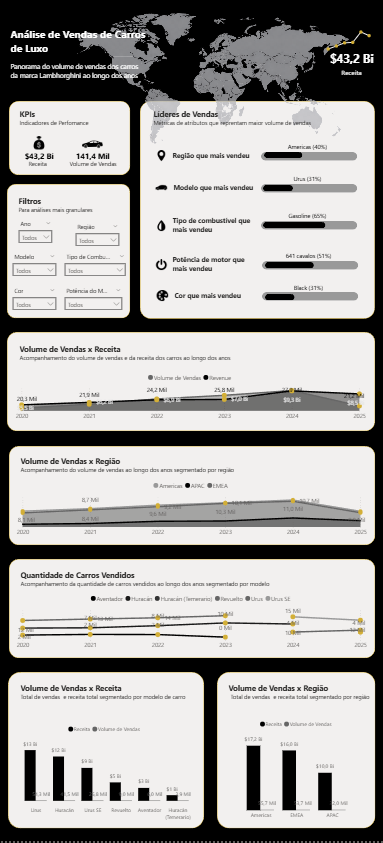
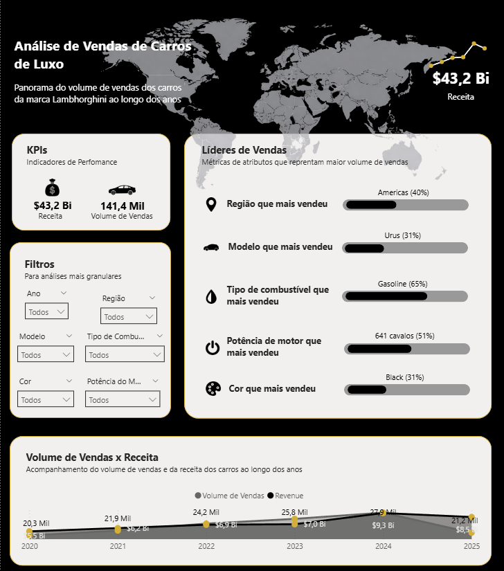
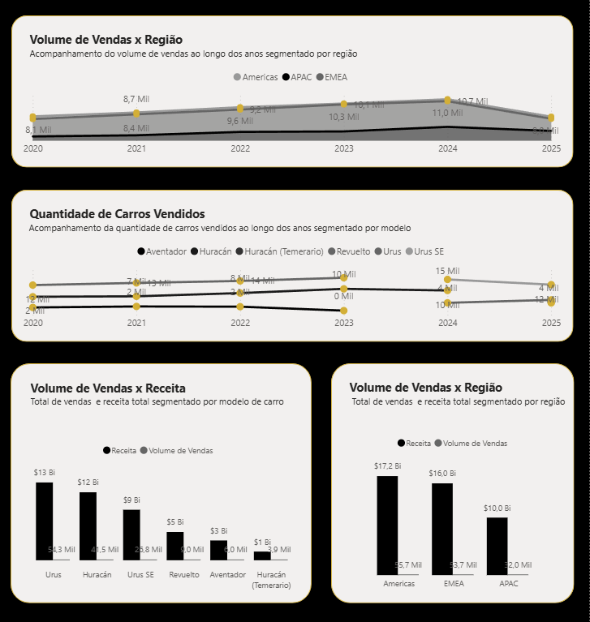

# Análise de Vendas Lamborghini (2020–2025)
------------------------------------------------------------------------------

#### Anna Paula Viana Campelo Mendes
##### Analista de Dados

--------------------------------------------------------------------------------

🇧🇷 Versão em português  
🇺🇸 English version below

--------------------------------------------------------------------------------
## 🇧🇷 Versão em Português
## :black_circle: Objetivo

Este projeto analisa os dados de vendas da Lamborghini para identificar os principais drivers de receita, padrões de vendas e tendências de mercado.

## :black_circle: Estrutura do Projeto

Este projeto é dividido em duas principais partes:

- Análise Exploratória de Dados (EDA)
- Dashboard Interativo

│ 
├── notebooks/ 
│ └── lamborghini-sales-analysis.ipynb 
│ 
├── dashboard/ 
│ └── dashboard.pbix 
│ 
├── images/ 
│ └── *.png 
│ 
└── README.md 

O EDA está disponível no repositório na pasta '/notebooks' e contém o processo completo de análise, incluindo limpeza de dados, exploração e geração de insights. 
O dashboard interativo em Power BI está disponível na pasta '/dashboard' e foi desenvolvido para visualização dinâmica dos principais insights, permitindo análises por diferentes dimensões de negócio. 

## :black_circle: Dataset

O dataset utilizado concentra dados das vendas dos carros entre os anos de 2020 e 2025 e contém informações como:
- Modelo do carro
- Preço de Venda
- Volume de Vendas
- Região

Dentre outras colunas.

Este dataset foi obtido no site Kaggle, através do link https://www.kaggle.com/datasets/zahranusratt/lamborghini-global-sales-dataset-20202025 

Também está disponível neste repositório. 

## :black_circle: Insights
- A receita da empresa está concentrada em poucos modelos, sendo estes Huracán, Urus e Urus SE.
- Americas e EMEA dominam o mercado de vendas.
- Houve uma forte queda no volume de vendas entre 2024 e 2025.
- Carros à gasolina dominam porém o mercado mostra uma tendência na transição para modelos híbrido-elétricos.

## :black_circle: Dashboard

Para ajudar na visualização do projeto, foi construído um dashboard interativo no Power BI, o qual permite análises interativas por diferentes dimensões de negócio, facilitando a identificação de padrões relevantes para tomada de decisão.
Algumas imagens do dashboard podem ser observadas a seguir, o arquivo .pbix também pode ser obtido neste repositório.

### Visão Geral do dashboard
Visão panorâmica e geral do dashboard. 
 

### Análises focadas das vendas
Visão mais ampla dos gráficos que são focados nas vendas e receita da empresa. 
 
 

Para este dashboard foram utilizadas as cores preto e dourado, utilizando um modelo minimalista, design adotado pela empresa Lamborghini a partir de 2024.

## :black_circle: Ferramentas Utilizadas

Na construção deste projeto foram utilizados:
- Python (Matplotlib, Pandas, NumPy)
- Power BI
- Jupyter Notebook

## :black_circle: Conclusão
Esta análise aponta que a receita da empresa depende fortemente de alguns poucos modelos de carro e está concentrada em duas regiões de vendas. Além disso, aponta uma tendência de mudança no mercado para carros híbrido-elétricos.

## :black_circle: Contato
Sinta-se à vontade para me contatar para novas oportunidades ou para dar feedback!

LinkedIn: [Aqui](https://www.linkedin.com/in/anna-paula-mendes-04737a224/) 
Email: m_annapaula@yahoo.com.br

--------------------------------------------------------------------------------

# Lamborghini Sales Analysis (2020–2025)
------------------------------------------------------------------------------

#### Anna Paula Viana Campelo Mendes
##### Data Analyst

------------------------------------------------------------------------------

## 🇺🇸 English Version
## :black_circle: Objective

This project analyzes Lamborghini sales data to identify revenue drivers, sales patterns, and market trends.

## :black_circle: Project Structure

Este projeto é dividido em duas principais partes:

- Exploratory Data Analysis (EDA)
- Interactive dashboard

│ 
├── notebooks/ 
│ └── lamborghini-sales-analysis.ipynb 
│ 
├── dashboard/ 
│ └── dashboard.pbix 
│ 
├── images/ 
│ └── *.png 
│ 
└── README.md 

The EDA is available in the repository under the '/notebooks' folder and contains the full analysis process, including data cleaning, exploration, and insight generation. 
The interactive Power BI dashboard is available in the '/dashboard' folder and was developed to provide dynamic visualization of key insights, enabling analysis across different business dimensions. 

## :black_circle: Dataset

The dataset contains sales data for Lamborghini car models between 2020 and 2025, including:

- Car model
- Base price (USD)
- Sales volume
- Region
- Other relevant columns

The dataset is available on Kaggle:
https://www.kaggle.com/datasets/zahranusratt/lamborghini-global-sales-dataset-20202025

It is also available in this repository. 

## :black_circle: Insights

- Company revenue is concentrated in a few key models, especially Huracán, Urus, and Urus SE.
- The Americas and EMEA regions account for the highest sales volume.
- Sales volume declined significantly between 2024 and 2025.
- Gasoline vehicles still dominate the market, but there is a growing trend toward hybrid-electric models.

## :black_circle: Dashboard

To support data visualization, a Power BI dashboard was developed. It enables interactive analysis across different business dimensions, helping identify relevant patterns and trends for decision-making.

Some dashboard images are shown below. The .pbix file is also available in this repository.

* The dashboard is available in Portuguese (PT-BR), as the dataset and analysis were focused on the Brazilian market.

### Dashboard Overview
High-level view of the dashboard, presenting key metrics and overall performance. 
 

### Sales Analysis
Detailed view of sales and revenue, focusing on key patterns and trends. 
 
 

* Dashboard language: Portuguese (PT-BR)

The dashboard follows a black and gold color scheme with a minimalist design, inspired by Lamborghini’s visual identity since 2024.

## :black_circle: Tools Used

The following tools were used in this project:
- Python (Matplotlib, Pandas, NumPy)
- Power BI 
- Jupyter Notebook

## :black_circle: Conclusion

This analysis shows that the company’s revenue is highly concentrated in a few key car models and in two main regions. In addition, the market indicates a growing trend toward hybrid-electric vehicles.

## :black_circle: Contact

Feel free to reach out for opportunities or feedback.

LinkedIn: [Aqui](https://www.linkedin.com/in/anna-paula-mendes-04737a224/) 
Email: m_annapaula@yahoo.com.br
